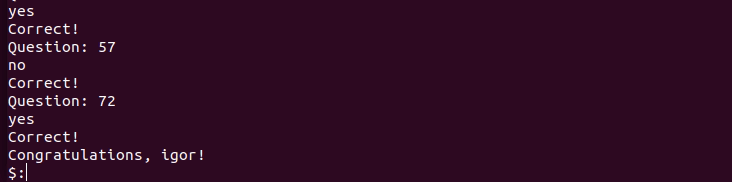

<a name="begin"># The brain-games.</a>
Here you can find a small kit of games you can play with console. 
1. [Is number even?](#even)
2. [Calculate the value of the expression.](#calc)
3. [Find greater common divisor of two numbers.](#gcd)
4. [Balance the number.](#balance)
5. [Insert the missing number in arithmetic progression.](#progression)
6. [Is number prime?](#prime)

[](https://codeclimate.com/github/lightmonk1911/project-lvl1-s320/maintainability)
[](https://codeclimate.com/github/lightmonk1911/project-lvl1-s320/test_coverage)
[](https://travis-ci.org/lightmonk1911/project-lvl1-s320)

## Install

```bash
$ npm install -g hexlet_pr_1_second_attempt
```
<a name="even">###Even</a>
1. This is the simpliest game in this collection. Just for start.
Let's check if you know how to recognize even number:)
```bash
$ brain-even
```


<a name="calc"></a>
<a name="gcd"></a>
<a name="balance"></a>
<a name="progression"></a>
<a name="prime"></a>