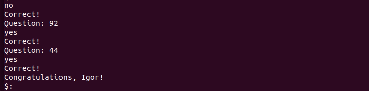
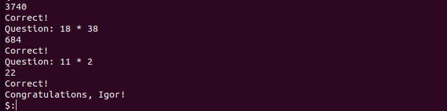
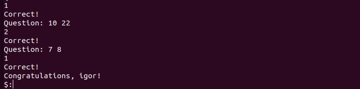
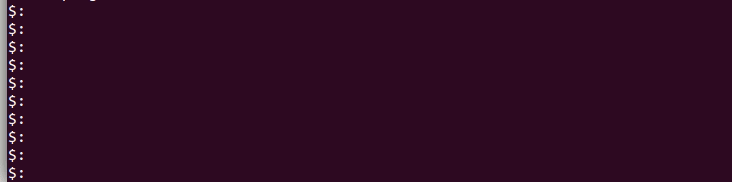
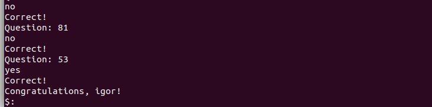

<a name="begin"># The brain-games.</a>
Here you can find a small kit of games you can play with console. 
1. [Is number even?](#even)
2. [Calculate the value of the expression.](#calculator)
3. [Find greater common divisor of two numbers.](#greater common divisor)
4. [Balance the number.](#balance)
5. [Insert the missing number in arithmetic progression.](#progression)
6. [Is number prime?](#prime)

[](https://codeclimate.com/github/lightmonk1911/project-lvl1-s320/maintainability)
[](https://codeclimate.com/github/lightmonk1911/project-lvl1-s320/test_coverage)
[](https://travis-ci.org/lightmonk1911/project-lvl1-s320)

## Install

```bash
$ npm install -g hexlet_pr_1_second_attempt
```
### Even
This is the simpliest game in this collection. Just for start.
Let's check if you know how to recognize even number:)
```bash
$ brain-even
```

### Calculator
Everything is comletely simple. Just calculate it. 
P.S. It was joke about simple:)
```bash
$ brain-calc
```

### Greater common divisor
Did you like math in your childhood? Here you have to remember what is greater common divisor.
```bash
$ brain-gcd
```

### Balance
Balance the given number. Number is balanced when the difference between biggest and smallest digit of number is less than 2. To balance number we take 1 from biggest and give it to smallest digit and repeat while number is unbalanced. After that you should sort digits of number and enter your answer.
For example 2691 => 2682 => 2673 => 3663 => 4563 => 4554 => 4455.
It's more difficult to explain than to resolve.
```bash
$ brain-balance
```

### Progression
Find missing number. Without calculator. It's brain games, not finger training.
```bash
$ brain-progression
```

### Prime
Prime numbers has two different natural divisors. No less, no more. Use tips from school. Build new neural connections in your intraparietal sulcus(or somewhere else).
```bash
$ brain-prime
```
